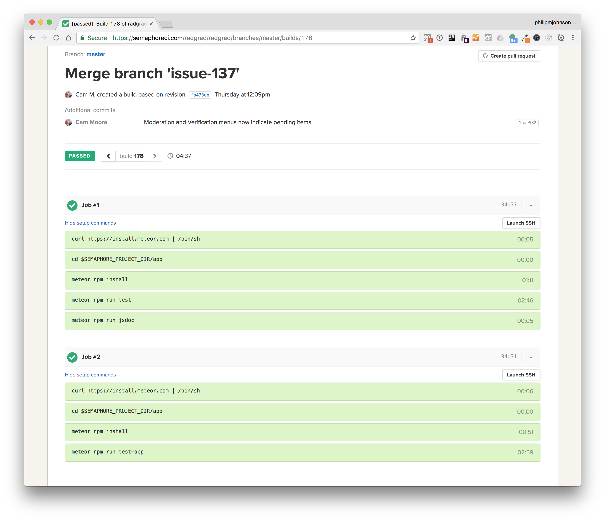

We use Semaphore CI for [RadGrad Continuous Integration](https://semaphoreci.com/radgrad/radgrad). Each time someone commits to the [master branch of the RadGrad datamodel GitHub repo](https://github.com/radgrad/datamodel), Semaphore will clone this branch, install Meteor, invoke both unit and integration tests, and build the JSDocs. 

Here is an example build and run of the system:

Current build status: 

 
